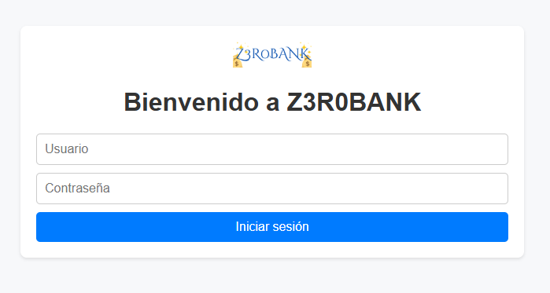

# CSWSH Lab

Laboratorio vulnerable a **Cross-Site WebSocket Hijacking** (*CSWSH*) inspirado en una aplicación bancaria.




- [CSWSH Lab](#cswsh-lab)
  - [Setup](#setup)
      - [Requisitos previos](#requisitos-previos)
      - [Instalación](#instalación)
      - [Run it!](#run-it)
  - [Write Up](#write-up)
  - [Donaciones](#donaciones)

## Setup

#### Requisitos previos
+ Linux
```bash
sudo apt update
sudo apt install nodejs npm libnss3-tools 
sudo apt install mkcert
npm install --global http-server
```
* Windows
 - Descarga [NodeJS](https://nodejs.org/en)
 - Descarga [mkcert](https://github.com/FiloSottile/mkcert?tab=readme-ov-file)
 - Descarga [http-server](https://www.npmjs.com/package/http-server)

#### Instalación
```bash
git clone https://github.com/z3robyte/CSWSH-lab
cd CSWSH-lab
npm install
```
Para que sea posible la vulnerabilidad en este lab, el servidor local debe usar **HTTPS**, debido a que las cookies tienen que tener el atributo `SameSite=None`, y por requerimiento de este, el atributo `secure`. Más info [aquí](https://developer.mozilla.org/en-US/docs/Web/HTTP/Headers/Set-Cookie#none).

A continuación veremos como generar e instalar los certificados necesarios ello:
```bash
cd certificates
mkcert install # si da problemas, ejecutar como admin o root
mkcert localhost
```
#### Run it!
+ Para levantar la aplicación:
```bash
node app.js
# https://localhost:3000
```
Hay 2 usuarios, cuyas credenciales son: ``victim:pass123`` y ``attacker:haxxor1``
+ Para levantar el servidor del atacante:
```bash
cd exploit
http-server -S -C "../certificates/localhost.pem" -K "../certificates/localhost-key.pem"
# https://localhost:8080
```

> Acordarse acceder a los servidores por HTTPS

## Write Up

La aplicación web usa [websockets](https://developer.mozilla.org/en-US/docs/Web/API/WebSocket) para realizar transacciones de dinero ficticio entre usuarios. Sin embargo, el **handshake** del _websocket_ depende únicamente de la cookie de sesión para establecerse (la cual tiene `sameSite=None`), por lo que podemos crear un sitio malicioso para que cuando una víctima lo visite se establezca una conexión _websocket_ de forma silenciosa con javascript y nos enviemos dinero a nuestra cuenta. 

Este ataque es parecido a un [CSRF](https://es.wikipedia.org/wiki/Cross-site_request_forgery) pero aplicado a los _websockets_.

Aquí tienes un video mostrando la explotación de la vulnerabilidad (haz click en la imagen):

[](https://www.youtube.com/watch?v=Ifmx0qfPqdw)


## Donaciones

Si este proyecto te ha ayudado a aprender algo, considera aportar tu granito de arena para hacer más labs como este.

[](https://buymeacoffee.com/z3robyte)
